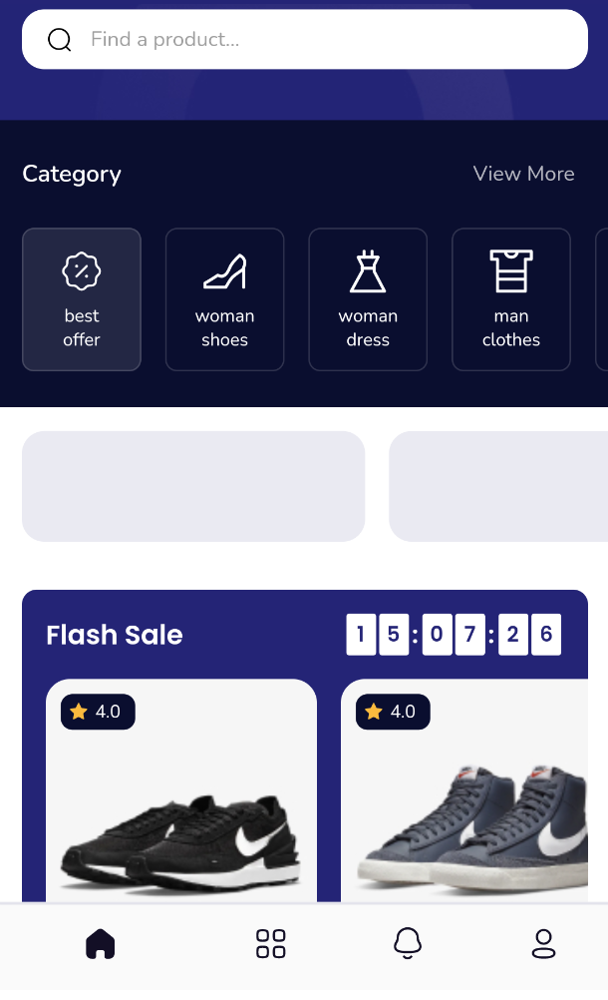
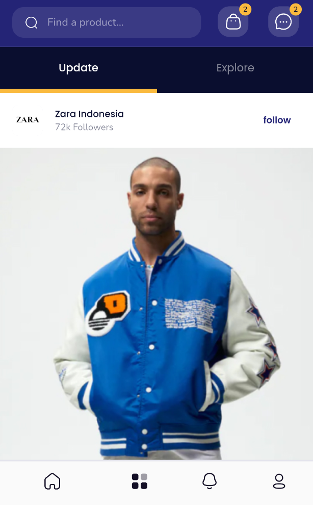
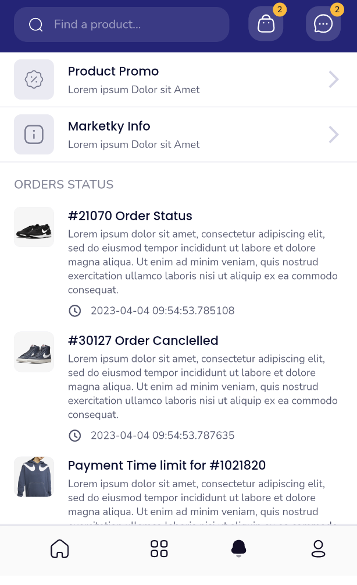
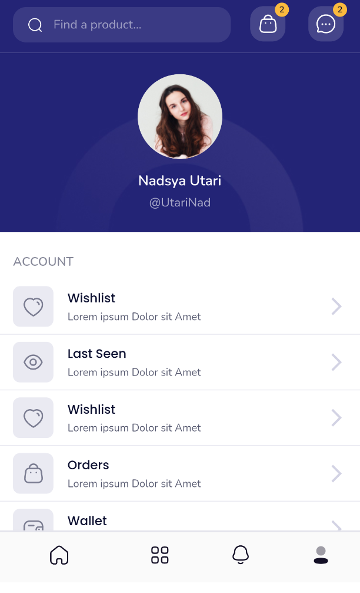

<h2>Ecommerce Demo</h2>

<h2>Whats inside</h2>
<ul>
    <li>GUI: fork of existing repository https://github.com/ferdirhyme/marketplace</li>
    <li>Rest API: Retrofit</li>
</ul>
<h2>Screenshots</h2>
<table width="100%">
<tr>
    <td ></td><td></td><td></td>
</tr>
<tr>
    <td ></td><td></td><td></td>
</tr>
</table>
